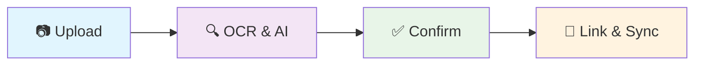
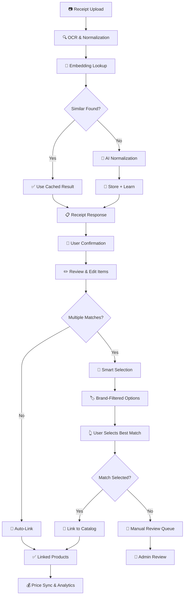

# 🐝 Beezly

> **AI-powered receipt intelligence platform** that helps users compare local prices, track spending, and make smarter offline purchasing decisions.

---

## 📋 Table of Contents

- [🚀 Quick Start](#-quick-start)
- [🤖 What Makes Beezly Special](#-what-makes-beezly-special)
- [🏗️ Architecture Overview](#️-architecture-overview)
- [⚡ How It Works](#-how-it-works)
- [🛠️ Development](#️-development)
- [🤝 Contributing](#-contributing)

---

## 🚀 Quick Start

### ⚡ Get Running in 30 Seconds

```bash
# 1. Clone and setup
git clone https://github.com/BeezlyAI/Beezly.git
cd beezly && pnpm install

# 2. Start everything (includes auto database setup!)
pnpm dev
```

**That's it!** 🎉 The development environment automatically:
- ✅ Checks PostgreSQL connection
- ✅ Creates local database if needed  
- ✅ Runs all migrations and seeds data
- ✅ Starts all development servers

### 🌐 Access Your Apps

- **API**: http://localhost:3006 (NestJS backend)
- **Web**: http://localhost:3001 (Next.js frontend)
- **Mobile**: Expo DevTools (React Native)
- **AI**: http://localhost:8000 (Python FastAPI)

<details>
<summary>📚 Manual Setup (Advanced)</summary>

```bash
# Run services individually
pnpm dev --filter=api     # API only
pnpm dev --filter=web     # Web only
cd apps/mobile && npx expo start  # Mobile only
cd apps/ai && uvicorn app.main:app --port 8000  # AI only
```

For detailed setup instructions, see [DEVELOPER_SETUP.md](DEVELOPER_SETUP.md)
</details>

---

## 🤖 What Makes Beezly Special

### 🧠 **Revolutionary Receipt Processing**

Beezly transforms receipt scanning from tedious manual work into intelligent automation:

| **Before** | **After** |
|------------|-----------|
| ❌ 15+ second processing | ✅ **2-3 seconds** |
| ❌ Manual product matching | ✅ **AI learns and remembers** |
| ❌ Endless scrolling through matches | ✅ **Brand-aware filtering** |
| ❌ Cross-receipt confusion | ✅ **Receipt-scoped operations** |
| ❌ Expensive API costs | ✅ **95% cost reduction** |

### 🚀 **4-Stage Intelligence Pipeline**



1. **📷 Upload & OCR** → Lightning-fast scanning with embedding-based learning
2. **✅ Review & Confirm** → User reviews and edits normalized product names
3. **🎯 Smart Selection** → AI resolves multiple matches with brand intelligence
4. **🔗 Link & Sync** → Automatic catalog linking and price tracking

### ⚡ **Performance That Matters**

- **🚀 Speed**: 2-3 second receipt processing (was 15+ seconds)
- **🎯 Accuracy**: 90%+ brand matching for store brands (Kirkland, Great Value, etc.)
- **💰 Efficiency**: 95% fewer API calls through intelligent caching
- **🧠 Intelligence**: Builds store-specific vocabularies that improve over time
- **👤 UX**: 70% fewer irrelevant options shown to users

---

## 🏗️ Architecture Overview

### 🧱 **Monorepo Structure**

```
beezly/
├── apps/
│   ├── web/        # Next.js 15 (receipt feedback, viral microsite)
│   ├── api/        # NestJS backend (auth, points, normalization)
│   ├── mobile/     # React Native + Expo (scanning, profile, leaderboard)
│   └── ai/         # Python FastAPI (OCR/NLP engine)
├── packages/
│   └── shared/     # Shared TypeScript types and utilities
└── turbo.json      # Turborepo pipeline configuration
```

### 🛠️ **Technology Stack**

| **Layer** | **Technology** | **Purpose** |
|-----------|----------------|-------------|
| **Frontend** | Next.js 15, React Native + Expo | Web app, mobile app |
| **Backend** | NestJS, FastAPI + Python | API services, AI processing |
| **Database** | PostgreSQL + pgvector | Relational data + vector embeddings |
| **AI/ML** | OpenAI GPT-4, Azure Form Recognizer | Receipt processing, OCR |
| **Authentication** | Supabase Auth + JWT | Secure auth with Google OAuth |
| **Infrastructure** | Turborepo, Docker | Monorepo management, containerization |
| **DevOps** | GitHub Actions, TypeScript | CI/CD, type safety |

### 🧠 **AI Intelligence Stack**

- **📄 OCR**: Azure Form Recognizer for receipt text extraction
- **🤖 Normalization**: OpenAI GPT-4 for product name standardization  
- **🔍 Embeddings**: OpenAI text-embedding-3-small (1536 dimensions)
- **📊 Vector Search**: PostgreSQL pgvector with HNSW indexing
- **🏷️ Brand Matching**: Custom fuzzy logic for store brand variations
- **⚡ Caching**: Smart embedding reuse for 95% cost reduction

---

## ⚡ How It Works

<details>
<summary>🔍 <strong>Detailed Processing Workflow</strong></summary>



### **🎯 Advanced Features**

- **Enhanced Brand Matching**: Fuzzy logic handles variations (Kirkland ↔ Kirkland Signature)
- **Receipt-Scoped UI**: Complete isolation prevents cross-receipt confusion
- **Progressive Enhancement**: User edits boost confidence scores (+0.1)
- **Empty Selection Support**: Users can indicate "no good match found"
- **Comprehensive Audit Trail**: Full tracking from OCR → confirmation → linking → pricing
- **Store-Specific Learning**: Builds vocabulary for each merchant over time

### **📊 Technical Metrics**

- **Processing Speed**: 2-3 seconds average (down from 15+ seconds)
- **Brand Accuracy**: 90%+ for store brands (Kirkland, Great Value, etc.)
- **User Efficiency**: 70% fewer irrelevant options shown
- **Cost Optimization**: 95% fewer OpenAI API calls through embedding reuse
- **Coverage**: 85%+ embedding coverage after initial processing

</details>

---

## 🛠️ Development

### 📦 **Essential Commands**

```bash
# 🚀 Development
pnpm dev          # Start all dev apps with Turbo
pnpm dev --filter=api    # Start only API
pnpm dev --filter=web    # Start only web app

# 🏗️ Building
pnpm build        # Build all apps for production
pnpm build --filter=mobile  # Build only mobile app

# 🧪 Quality Assurance  
pnpm lint         # Lint all apps
pnpm test         # Run all tests
pnpm type-check   # TypeScript validation
```

### 📚 **App-Specific Documentation**

| **App** | **Purpose** | **Documentation** | **Key Features** |
|---------|-------------|-------------------|------------------|
| **🚀 [API](./apps/api/README.md)** | NestJS Backend | **[Complete Guide](./apps/api/README.md)** <br/> [Authentication](./apps/api/docs/AUTH_USAGE_GUIDE.md) \| [OAuth Setup](./apps/api/docs/OAUTH_SETUP.md) \| [Database](./apps/api/docs/DATABASE.md) | Receipt processing, JWT auth, PostgreSQL, Supabase integration |
| **🌐 [Web](./apps/web/README.md)** | Next.js Frontend | **[Setup Guide](./apps/web/README.md)** | Receipt feedback, viral microsite, App Router |
| **📱 [Mobile](./apps/mobile/README.md)** | React Native + Expo | **[Mobile App Guide](./apps/mobile/README.md)** \| [Authentication](./apps/mobile/AUTHENTICATION.md) | Receipt scanning, profile, leaderboard, OAuth |

**Quick Navigation:**
- **New Developer?** → Start with [API Guide](./apps/api/README.md) for backend setup
- **Frontend Work?** → See [Web App Guide](./apps/web/README.md) for Next.js setup  
- **Mobile Development?** → Check [Mobile App Guide](./apps/mobile/README.md)
- **Authentication?** → Go to [Auth Usage Guide](./apps/api/docs/AUTH_USAGE_GUIDE.md)

### 📋 **Project Structure**

<details>
<summary>Click to explore the detailed codebase organization</summary>

```
beezly/
├── apps/
│   ├── web/                 # Next.js 15 Web Application
│   │   ├── src/app/         # App Router pages
│   │   ├── src/components/  # Reusable UI components
│   │   └── src/lib/         # Utilities and configurations
│   │
│   ├── api/                 # NestJS Backend API
│   │   ├── src/entities/    # Database entities (TypeORM)
│   │   ├── src/product/     # Product processing services
│   │   ├── src/ocr/         # OCR and receipt processing
│   │   └── src/migrations/  # Database migrations
│   │
│   ├── mobile/              # React Native + Expo
│   │   ├── src/screens/     # Mobile screens
│   │   ├── src/components/  # Mobile components
│   │   └── src/services/    # API integration
│   │
│   └── ai/                  # Python FastAPI (AI/ML Services)
│       ├── app/             # FastAPI application
│       ├── models/          # ML models and processing
│       └── services/        # AI service implementations
│
├── packages/
│   └── shared/              # Shared TypeScript utilities
│       ├── types/           # Common type definitions
│       └── utils/           # Shared utility functions
│
└── Configuration Files
    ├── turbo.json           # Turborepo pipeline config
    ├── tsconfig.json        # TypeScript configuration
    └── .github/workflows/   # CI/CD pipelines
```

</details>

### 🧪 **CI/CD Pipeline**

Our automated pipeline ensures code quality and seamless deployments:

| **Stage** | **What It Does** | **Tools** |
|-----------|------------------|-----------|
| **🔍 Lint** | Code style and quality checks | ESLint, Prettier |
| **🧪 Test** | Unit and integration tests | Jest, Testing Library |
| **🏗️ Build** | Production build verification | Turborepo, TypeScript |
| **🛡️ Security** | Dependency vulnerability scanning | npm audit, Snyk |
| **📱 Deploy** | Automated deployments | GitHub Actions, EAS |

**Performance Features:**
- ⚡ Smart caching with Turborepo  
- 🔄 Parallel job execution
- 📦 Node.js 23 + pnpm 10 optimization
- 🚀 Automatic error recovery

---

## 🤝 Contributing

### 🌊 **Branching Strategy**

We use a `staging` branch for integration testing before production:

```bash
# 1. Create feature branch from staging
git checkout staging
git pull origin staging
git checkout -b feature/your-awesome-feature

# 2. Make your changes
git add .
git commit -m "feat: add awesome feature"

# 3. Push and create PR to staging
git push origin feature/your-awesome-feature
# Open PR: feature/your-awesome-feature → staging
```

### ✅ **Before You Submit**

- [ ] **Tests pass**: `pnpm test`
- [ ] **Linting clean**: `pnpm lint`  
- [ ] **Types valid**: `pnpm type-check`
- [ ] **Builds successfully**: `pnpm build`
- [ ] **Feature documented**: Update relevant README sections

### 🎯 **Contribution Guidelines**

1. **🎯 Focus**: One feature or fix per PR
2. **📝 Describe**: Clear PR description with context
3. **🧪 Test**: Include tests for new functionality
4. **📚 Document**: Update docs for user-facing changes
5. **🔍 Review**: Address all review feedback

> **Note:** Never commit directly to `main` or `staging`. Always use feature branches and PRs.

---

## 📄 License

This project is part of the Beezly application ecosystem.
