# 🐝 Beezly

Beezly is an AI-powered receipt intelligence platform that helps users compare local prices, track spending, and make smarter offline purchasing decisions.

## 🧱 Monorepo Structure (Turborepo)

```
beezly/
├── apps/
│   ├── web/        # Next.js 15 app (receipt feedback, viral microsite)
│   ├── api/        # NestJS backend API (auth, points, normalization)
│   ├── mobile/     # React Native app via Expo (scanning, profile, leaderboard)
│   └── ai/         # Python FastAPI OCR/NLP engine (not part of Turbo workspace)
├── packages/
│   └── shared/     # Shared types and utilities (TypeScript)
├── turbo.json      # Turbo pipeline config
├── tsconfig.json   # TypeScript path mapping
├── package.json    # Workspace and scripts
```

## 🚀 Getting Started

### Quick Start (Recommended)

```bash
# 1. Clone the repo
git clone https://github.com/BeezlyAI/Beezly.git
cd beezly

# 2. Install dependencies
pnpm install

# 3. Start development (includes automatic database setup!)
pnpm dev
```

**That's it!** 🎉 The development environment will automatically:
- Check if PostgreSQL is running
- Create the local database if needed
- Run all migrations
- Seed sample data
- Start all development servers

### Manual Setup

If you prefer to run services individually:

```bash
# API (with auto database setup)
pnpm dev --filter=api

# Web app
pnpm dev --filter=web

# Mobile app
cd apps/mobile && npx expo start

# AI service (Python)
cd apps/ai && uvicorn app.main:app --port 8000
```

> 📚 For detailed setup instructions, see [DEVELOPER_SETUP.md](DEVELOPER_SETUP.md)

### Default Ports

- **API**: http://localhost:3006
- **Web**: http://localhost:3001  
- **Mobile**: Expo DevTools (varies)
- **AI**: http://localhost:8000

## 🧠 Core Technologies

- [Turborepo](https://turbo.build/repo)
- [Next.js](https://nextjs.org/)
- [NestJS](https://nestjs.com/)
- [React Native + Expo](https://expo.dev/)
- [FastAPI + Python](https://fastapi.tiangolo.com/)
- [Supabase](https://supabase.com/) (Auth, storage)
- [PostgreSQL + PostGIS](https://postgis.net/)
- [pgvector](https://github.com/pgvector/pgvector) (Vector similarity search for AI embeddings)
- [TypeORM](https://typeorm.io/) (Database ORM with geospatial support)
- [OpenAI](https://openai.com/) (GPT-4 + text-embedding-3-small for receipt processing)
- [@napi-rs/image](https://github.com/Brooooooklyn/Image) (High-performance image processing with native HEIC support)
- [Azure Form Recognizer](https://azure.microsoft.com/en-us/products/ai-services/ai-document-intelligence) (OCR and document processing)

## 🤖 AI-Powered Receipt Processing

Beezly features an advanced **embedding-based receipt processing system** that dramatically improves accuracy and speed:

### Key Features
- **🚀 Lightning Fast**: Receipt processing in 2-3 seconds (reduced from 15+ seconds)
- **🧠 Smart Learning**: AI learns from previous receipts to improve future accuracy  
- **🎯 High Accuracy**: 85%+ similarity matching with store-specific optimization
- **💰 Cost Efficient**: 95% reduction in API calls through intelligent batch processing
- **🔄 Self-Improving**: Builds store-specific product vocabularies over time

### How It Works

```mermaid
graph LR
    A[📷 Receipt Upload] --> B[🔍 OCR Extraction]
    B --> C[🧠 Embedding Lookup]
    C --> D{Similar Found?}
    D -->|Yes| E[✅ Use Cached Result]
    D -->|No| F[🤖 AI Normalization]
    F --> G[💾 Store + Learn]
    E --> H[📋 Enhanced Response]
    G --> H
```


### Technology Stack
- **Vector Embeddings**: OpenAI text-embedding-3-small (1536 dimensions)
- **Vector Database**: PostgreSQL with pgvector extension
- **Similarity Search**: Cosine distance with HNSW indexing
- **Batch Processing**: Optimized for multiple items per receipt
- **Async Learning**: Background embedding generation for instant responses

### Performance Metrics
- **Response Time**: 2-3 seconds average
- **Accuracy Improvement**: 85%+ similarity matching
- **API Efficiency**: 95% fewer OpenAI calls
- **Coverage**: 85%+ embedding coverage after initial processing

## 📦 Scripts

```bash
pnpm dev        # Start all dev apps with Turbo
pnpm build      # Build all apps
pnpm lint       # Lint all apps
pnpm test       # Run tests for all apps
pnpm type-check # TypeScript type checking
```

## 🧪 CI/CD Pipeline

This project includes comprehensive automated CI/CD pipelines for testing, building, and quality assurance. All workflows run on pull requests and pushes to main branches.

📋 **[Complete CI/CD Guide](.github/workflows/deploy.md)**

**Pipeline Overview:**
- **🔍 Lint**: Code style and quality checks across all apps
- **🧪 Test**: Unit and integration tests with coverage
- **🏗️ Build**: Production build verification and optimization
- **🛡️ Security**: Automated dependency vulnerability scanning
- **📱 Mobile Deploy**: Automated Expo builds and deployments via EAS
- **⚡ Performance**: Smart caching with Turborepo and GitHub Actions
- **📱 Apps**: Web (Next.js), API (NestJS), Mobile (React Native/Expo)

**Key Features:**
- Node.js 23 + pnpm 10 with smart dependency caching
- Parallel job execution for faster builds
- Automatic lockfile handling and error recovery
- TypeScript validation across all applications

## Commit & Branch Workflow

To keep the codebase stable and enable safe testing, we use a `staging` branch as an integration environment before merging to `main`.

**Workflow:**

1. **Create a feature branch:**
   ```bash
   git checkout -b feature/your-feature-name
   ```
2. **Make your changes and commit:**
   ```bash
   git add .
   git commit -m "feat: short description of your change"
   ```
3. **Push your branch:**
   ```bash
   git push origin feature/your-feature-name
   ```
4. **Open a Pull Request:**
   - Go to GitHub and open a PR **into `staging`** (not `main`).
   - Wait for code review and CI checks.
5. **Testing:**
   - All new features and fixes are tested on `staging` before merging to `main`.
6. **Merging to main:**
   - After successful testing and review, changes from `staging` are merged into `main`.

> **Note:** Never commit directly to `main` or `staging`. Always use feature branches and PRs.

## 📄 License
