# 🚀 Beezly API

> **High-performance NestJS backend** powering Beezly's AI-driven receipt processing and price intelligence platform.

---

## 📋 Table of Contents

- [⚡ Quick Start](#-quick-start)
- [🤖 What This API Does](#-what-this-api-does)
- [🔧 Core Services](#-core-services)
- [💻 Development Guide](#-development-guide)
- [🏗️ Architecture](#️-architecture)

---

## ⚡ Quick Start

### 🚀 **Get Running in 30 Seconds**

```bash
# 1. Install dependencies
pnpm install

# 2. Start with auto database setup
pnpm run dev
```

**That's it!** 🎉 The API automatically:
- ✅ Connects to PostgreSQL (creates database if needed)
- ✅ Runs all migrations and seeds data
- ✅ Starts the development server on http://localhost:3006

> 🔗 **API Documentation**: http://localhost:3006/api (Swagger UI)

<details>
<summary>📚 Manual Database Setup</summary>

```bash
# Set up database manually
pnpm run dev:setup

# Or run individual commands
pnpm run migration:run --filter=api
```

For detailed setup instructions, see [DATABASE_SETUP.md](./DATABASE_SETUP.md)
</details>

---

## 🤖 What This API Does

### 🎯 **The Problem We Solve**

Traditional receipt processing is:
- ❌ **Slow**: 15+ seconds per receipt
- ❌ **Expensive**: Costly AI API calls for every item
- ❌ **Confusing**: Users overwhelmed with irrelevant product matches
- ❌ **Error-Prone**: No learning from previous receipts

### ✅ **Our Solution: AI-Powered Intelligence**

Beezly API transforms receipt processing into a **lightning-fast, cost-efficient, learning system**:

| **Feature** | **Traditional** | **Beezly API** |
|-------------|-----------------|----------------|
| **Speed** | 15+ seconds | ⚡ **2-3 seconds** |
| **Cost** | High API usage | 💰 **95% cost reduction** |
| **Accuracy** | Generic matching | 🎯 **90%+ brand accuracy** |
| **Learning** | No memory | 🧠 **Store-specific vocabularies** |
| **UX** | Endless scrolling | 👤 **70% fewer irrelevant options** |

### 🚀 **4-Stage Intelligence Pipeline**

```mermaid
graph LR
    A[📷 Upload] --> B[🔍 AI Processing] --> C[✅ User Review] --> D[🔗 Smart Linking]
    
    style A fill:#e1f5fe
    style B fill:#f3e5f5  
    style C fill:#e8f5e8
    style D fill:#fff3e0
```



---

## 🔧 Core Services

### 📄 **1. Receipt Processing Engine**

**🧠 Embedding-Based Learning System**
- **Azure Form Recognizer v4.0**: High-accuracy OCR
- **OpenAI Embeddings**: Smart similarity matching with 95% cost reduction
- **Store-Specific Learning**: Builds vocabulary for each merchant
- **Multiple Formats**: PNG, JPG, JPEG, BMP, TIFF, WebP, HEIC, HEIF

### ✅ **2. User Confirmation & Review**
- **Receipt-Scoped Operations**: No cross-receipt contamination
- **Real-Time Editing**: User edits boost confidence scores (+0.1)
- **Comprehensive Summaries**: Complete linking statistics

### 🎯 **3. Smart Product Selection**
- **Enhanced Brand Matching**: Fuzzy logic (Kirkland ↔ Kirkland Signature) 
- **Brand-Filtered Results**: Only relevant products shown
- **Empty Selection Support**: "No good match found" handling

### 🔗 **4. Product Linking & Analytics**
- **Automatic Catalog Linking**: High-confidence matches
- **Unprocessed Queue**: Manual review for new products
- **Price Synchronization**: Historical tracking and analytics

📖 **[Detailed OCR Documentation](./src/ocr/README.md)**

### 🔐 **5. Additional Services**

| **Service** | **Purpose** | **Key Features** |
|-------------|-------------|------------------|
| **🔐 Auth** | User authentication | JWT tokens, session management |
| **👥 User** | Profile management | User data, preferences, history |
| **🏪 Store** | Store information | Location data, merchant details |
| **📦 Product** | Catalog management | Product database, CRUD operations |
| **🧾 Receipt** | Receipt data | Storage, metadata, relationships |
| **📊 Category** | Product categorization | Taxonomy, classification |

---

## 💻 Development Guide

### 🔧 **Complete API Examples**

<details>
<summary>📋 <strong>Stage 1: Receipt Processing</strong></summary>

```bash
# Enhanced Receipt Processing with AI Learning
curl -X POST http://localhost:3006/ocr/process-receipt-enhanced \
  -F "image=@receipt.jpg" \
  -F "endpoint=azure_endpoint" \
  -F "apiKey=azure_key"

# Response includes embedding lookups and normalized products
```

</details>

<details>
<summary>✅ <strong>Stage 2: User Confirmation</strong></summary>

```bash
# Process User Confirmations and Edits
curl -X POST http://localhost:3006/products/receipt/process-confirmations \
  -H "Content-Type: application/json" \
  -d '{
    "items": [
      {
        "normalizedProductSk": "123e4567-e89b-12d3-a456-426614174000",
        "normalizedName": "Organic Fuji Apples",
        "brand": "Green Valley Farms", 
        "isConfirmed": true
      }
    ],
    "userId": "user-uuid",
    "receiptId": "receipt-uuid"
  }'

# Returns: linked products, unprocessed items, pending selections
```

</details>

<details>
<summary>🎯 <strong>Stage 3: Smart Product Selection</strong></summary>

```bash
# Get Receipt-Scoped Pending Selections (Automatic)
curl -X GET http://localhost:3006/products/receipt/{receiptId}/pending-selections

# Process User Product Selections
curl -X POST http://localhost:3006/products/receipt/process-selections \
  -H "Content-Type: application/json" \
  -d '{
    "selections": [
      {
        "normalizedProductSk": "789e0123-e89b-12d3-a456-426614174002",
        "selectedProductSk": "product-1",
        "selectionReason": "Selected best match"
      },
      {
        "normalizedProductSk": "another-product-sk",
        "selectedProductSk": null,
        "selectionReason": "No suitable product found"
      }
    ]
  }'
```

</details>

<details>
<summary>🔗 <strong>Stage 4: Analytics & Management</strong></summary>

```bash
# Search Similar Products by Embedding
curl -X POST http://localhost:3006/products/search/embedding \
  -H "Content-Type: application/json" \
  -d '{"query":"apple juice","merchant":"WALMART","limit":3}'

# Check Embedding Coverage Statistics
curl http://localhost:3006/products/embeddings/stats

# Get Unprocessed Products for Review
curl http://localhost:3006/products/unprocessed/review?status=pending_review&limit=50

# Sync Receipt Prices to Historical Tracking
curl -X POST http://localhost:3006/products/sync-receipt-prices
```

</details>

### ⚙️ **Environment Setup**

<details>
<summary>🔧 <strong>Environment Variables (.env file)</strong></summary>

Create a `.env` file in the `apps/api` directory:

```bash
# 🚀 Application
NODE_ENV=development
PORT=3006

# 🗄️ Database (PostgreSQL)
DB_HOST=localhost
DB_PORT=5432
DB_USERNAME=root
DB_PASSWORD=root
DB_NAME=beezly_local
DB_SSL=false
DB_LOGGING=false  # Set to 'verbose' for debugging

# 🔐 Authentication
JWT_SECRET=your_jwt_secret_here

# 🤖 AI Services
OPENAI_API_KEY=your_openai_key_here

# 📄 Azure Form Recognizer (OCR)
AZURE_FORM_RECOGNIZER_ENDPOINT=https://your-resource.cognitiveservices.azure.com
AZURE_FORM_RECOGNIZER_API_KEY=your-azure-api-key

# ☁️ Supabase (Optional - for cloud features)
SUPABASE_URL=https://your-project.supabase.co
SUPABASE_SERVICE_ROLE_KEY=your-service-role-key
SUPABASE_ANON_KEY=your-supabase-anon-key
```

</details>

### 📦 **Development Commands**

```bash
# 🚀 Development
pnpm run start:dev     # Start with hot reload
pnpm run dev          # Same as above (alias)

# 🏗️ Production
pnpm run build        # Build for production
pnpm run start:prod   # Start production server

# 🧪 Quality & Testing
pnpm run lint         # Lint code
pnpm run test         # Run unit tests
pnpm run test:e2e     # Run end-to-end tests
pnpm run test:cov     # Test coverage report
```

---

## 🏗️ Architecture

### 📊 **API Documentation**

Once running, access interactive documentation:
- **🔗 Swagger UI**: http://localhost:3006/api
- **📖 OpenAPI Spec**: Comprehensive API documentation with examples

### 🗃️ **Database Management**

<details>
<summary>🔧 <strong>Migration Commands</strong></summary>

```bash
# 📊 Check Migration Status
pnpm run migration:show    # Show applied migrations
pnpm run migration:check   # Check pending migrations

# 🚀 Apply Migrations
pnpm run migration:run     # Apply pending migrations

# 📝 Create New Migrations
pnpm run migration:generate -- src/migrations/DescriptiveName
pnpm run migration:create -- src/migrations/EmptyMigration

# ⏪ Rollback
pnpm run migration:revert  # Rollback last migration
```

**🛡️ Safe Migration Workflow:**
1. **Make entity changes** → Modify TypeORM entities
2. **Generate migration** → `pnpm run migration:generate -- src/migrations/AddColumn`
3. **Review generated SQL** → Check `src/migrations/` directory
4. **Apply migration** → `pnpm run migration:run`
5. **Test changes** → `pnpm test`

</details>

<details>
<summary>⚠️ <strong>Database Safety Rules</strong></summary>

**🚨 CRITICAL: Never use these commands on production:**

```bash
# ❌ DANGEROUS - Drops all tables and data
dataSource.synchronize()
synchronize: true
pnpm run schema:sync
```

**✅ Safe Production Workflow:**
1. **Always backup** database before schema changes
2. **Use migrations only** (`synchronize: false`)
3. **Test on staging** with production data copy
4. **Apply migrations safely** in production

**🆘 Emergency Recovery:**
1. **Restore from backup** immediately
2. **Mark baseline**: `pnpm run migration:mark-baseline --filter=api`
3. **Apply new migrations**: `pnpm run migration:run --filter=api`

</details>

### 🏛️ **Architecture Patterns**

The API follows **Clean Architecture** principles:

| **Layer** | **Responsibility** | **Components** |
|-----------|-------------------|----------------|
| **🌐 Presentation** | HTTP handling | Controllers, DTOs, Guards |
| **💼 Business** | Core logic | Services, Use Cases |
| **🗄️ Data** | Persistence | Entities, Repositories |
| **🔧 Infrastructure** | External services | OCR, AI, File storage |

### 🎯 **Key Design Patterns**

- **📦 Dependency Injection**: NestJS IoC container
- **🎭 Repository Pattern**: Data access abstraction
- **📝 DTO Pattern**: Request/response validation
- **🛡️ Guard Pattern**: Authentication and authorization
- **🔄 Interceptor Pattern**: Cross-cutting concerns (logging, caching)
- **📊 Observer Pattern**: Event-driven processing

### 🧪 **Testing Strategy**

```bash
# 🧪 Unit Tests
pnpm run test          # Run all unit tests
pnpm run test:watch    # Watch mode for development
pnpm run test:cov      # Coverage report

# 🔗 Integration Tests  
pnpm run test:e2e      # End-to-end API testing

# 📊 Test Coverage Goals
# - Unit Tests: >80% coverage
# - Integration Tests: >70% coverage
# - Critical Paths: 100% coverage
```

---

## 🤝 Contributing

### ✅ **Quality Checklist**

Before submitting changes:

- [ ] **🧪 Tests Pass**: `pnpm test && pnpm run test:e2e`
- [ ] **📏 Linting Clean**: `pnpm run lint`
- [ ] **🔍 Types Valid**: `pnpm run type-check`
- [ ] **🏗️ Builds Successfully**: `pnpm run build`
- [ ] **📊 Migration Generated**: For entity changes
- [ ] **📖 API Docs Updated**: For new endpoints

### 🌟 **Best Practices**

1. **🎯 Single Responsibility**: One feature per PR
2. **📝 Clear Descriptions**: Explain the why, not just the what
3. **🧪 Test Coverage**: Include tests for new functionality
4. **📚 Documentation**: Update Swagger/OpenAPI specs
5. **🔒 Security**: Never expose sensitive data in logs

---

## 📄 License

This project is part of the Beezly application ecosystem.
