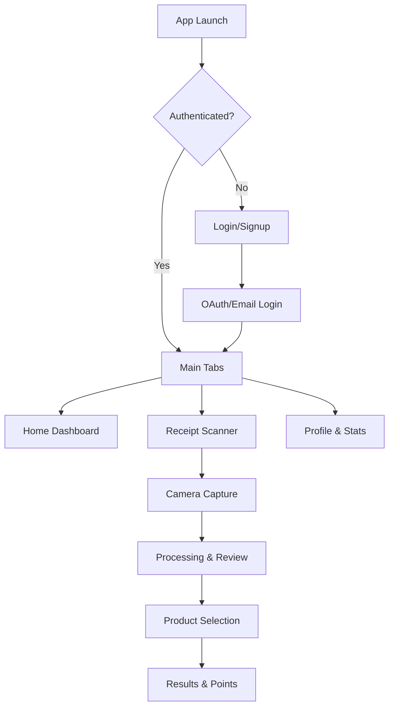

# 📱 Beezly Mobile App

> **React Native + Expo app** for AI-powered receipt scanning, price comparison, and gamified shopping experience.

---

## 📋 Table of Contents

- [⚡ Quick Start](#-quick-start)
- [🎯 Core Features](#-core-features)
- [🎮 Gamification & Achievements](#-gamification--achievements)
- [🛠️ Technology Stack](#️-technology-stack)
- [💻 Development](#-development)
- [🏗️ Architecture](#️-architecture)
- [🔐 Authentication](#-authentication)

---

## ⚡ Quick Start

### 🚀 **Get Running in 60 Seconds**

```bash
# From project root
pnpm install

# Navigate to mobile app
cd apps/mobile

# Start Expo development server
npx expo start
```

**Access options:**
- 📱 **Expo Go**: Scan QR code with Expo Go app
- 📲 **iOS Simulator**: Press `i` in terminal
- 🤖 **Android Emulator**: Press `a` in terminal

<details>
<summary>📚 Device Setup</summary>

**iOS Development:**
```bash
# Install Xcode from App Store
# Install iOS Simulator
npx expo run:ios
```

**Android Development:**
```bash
# Install Android Studio
# Set up Android emulator
npx expo run:android
```

</details>

---

## 🎯 Core Features

### 📷 **Receipt Scanning & Processing**

The mobile app is the **primary interface** for Beezly's AI-powered receipt intelligence:

| **Feature** | **Capability** | **User Benefit** |
|-------------|----------------|------------------|
| **📸 Smart Camera** | AI-powered receipt capture with auto-cropping | One-tap receipt scanning |
| **⚡ Fast Processing** | 2-3 second receipt processing via API | Instant results, no waiting |
| **✅ Review & Confirm** | User validation of extracted products | High accuracy, personalized learning |
| **🎯 Product Selection** | Smart matching with brand awareness | Relevant results, fewer false matches |

### 🏆 **Gamification & Social**

| **Feature** | **Purpose** | **User Benefit** |
|-------------|-------------|------------------|
| **🏅 Points & Badges** | Reward scanning activity and accuracy | Motivation, achievement tracking |
| **📊 Leaderboards** | Competition with other users | Social engagement, friendly competition |
| **🎖️ Rank System** | Progress tracking and status | Clear progression path |
| **👥 Profile Management** | Personal stats and achievements | Personalized experience |

### 🔐 **Authentication & Security**

- **Email/Password**: Traditional authentication
- **Google OAuth**: One-tap social login
- **JWT Tokens**: Secure session management
- **Biometric**: Face ID / Fingerprint support (planned)

---

## 🎮 Gamification & Achievements

### 🏆 **Engaging User Experience Design**

The mobile app transforms data collection into an engaging bee-themed game with instant feedback, visual progression, and social competition.

### 📱 **Real-Time Achievement System**

**Instant Notifications:** Users receive immediate visual feedback for all activities:
- 🍯 **Product Registration**: "+20 points! New honey discovered!" with bee-themed animations
- 📱 **Barcode Scan**: "+10 points! Nice scan! Product details loading" with purple accent
- 📄 **Receipt Upload**: "+30 points! Great job capturing your receipt" with green celebration
- ✅ **OCR Verification**: "+25 points! Thank you for improving accuracy" with blue checkmark
- 🚪 **Daily Login**: "+5 points! Welcome back!" with warm greeting

### 🐝 **Visual Progression System**

**Bee-Themed Tier System:**
```
🥇 Queen Bee      (2000+ pts)  ← Elite contributors
🐝 Worker Bee     (1000+ pts)  ← Active community members  
🌼 Busy Bee       (500+ pts)   ← Regular contributors
🌱 New Bee        (100+ pts)   ← Getting started
🥚 Egg            (0+ pts)     ← Welcome aboard!
```

**Smart Badge System:**
- 📱 **Scanner Badge**: First barcode scan completion
- 🎯 **Accuracy Expert**: 10+ OCR verifications with high confidence
- 🍯 **Product Pioneer**: Register 5+ new products
- 🔥 **Streak Master**: 7-day consecutive login streak
- 👑 **Community Leader**: Reach leaderboard top 10

### 📊 **Social Leaderboards**

**Dynamic Rankings:**
- **Weekly Competition**: Fresh leaderboards every week
- **Anonymous Privacy**: Users display as "bee#001" if no name provided
- **Real-Time Updates**: Instant rank changes with smooth animations
- **Achievement Celebrations**: Special recognition for tier promotions

### 🎨 **UI/UX Features**

**Staggered Notifications:** Multiple achievements show with delays:
1. **Main Achievement** (immediate): Primary action reward
2. **Badge Earned** (+1 second): New badge celebrations
3. **Tier Promotion** (+2 seconds): Rank advancement with special effects

**Smart Duplicate Prevention:** Sophisticated tracking prevents notification spam while ensuring genuine achievements are celebrated.

**Contextual Integration:** 
- Profile screen shows comprehensive stats and progress
- Leaderboard updates in real-time during usage
- Achievement tracking integrated into all user flows

### 🛠️ **Technical Implementation**

**State Management:**
- **AuthContext**: User authentication and profile data
- **NotificationContext**: Achievement notification system with animation queue
- **Custom Hooks**: `useAchievementTracking()` for consistent reward handling

**API Integration:**
- Real-time scoring via authenticated endpoints
- Automatic point awards for all user activities  
- Cross-platform synchronization with backend gamification engine

**Performance Optimizations:**
- **useCallback**: Prevents unnecessary re-renders in notification system
- **useRef**: Duplicate prevention without state dependency loops
- **Staggered Timing**: Prevents notification overflow with smooth UX

---

## 🛠️ Technology Stack

### 📦 **Core Technologies**

| **Layer** | **Technology** | **Purpose** |
|-----------|----------------|-------------|
| **Framework** | React Native + Expo | Cross-platform mobile development |
| **Navigation** | Expo Router | File-based routing and navigation |
| **State Management** | React Context + Hooks | Authentication and global state |
| **API Integration** | Fetch API | Communication with NestJS backend |
| **Authentication** | Supabase + JWT | Secure user sessions |
| **Camera** | Expo Camera | Receipt scanning functionality |
| **OAuth** | expo-auth-session | Google OAuth integration |

### 🔧 **Key Dependencies**

```json
{
  "expo": "~52.x",
  "react-native": "0.76.x",
  "typescript": "5.x",
  "expo-camera": "~16.x",
  "expo-auth-session": "~6.x",
  "@react-native-async-storage/async-storage": "~2.x"
}
```

---

## 💻 Development

### 🧪 **Available Commands**

```bash
# 🚀 Development
npx expo start              # Start Expo development server
npx expo start --clear      # Clear cache and start
npx expo start --tunnel     # Enable tunneling for remote testing

# 📱 Platform-Specific
npx expo run:ios            # Run on iOS simulator/device
npx expo run:android        # Run on Android emulator/device

# 🏗️ Building
npx expo build:ios          # Build iOS app
npx expo build:android      # Build Android app
eas build --platform all    # Build with EAS (Expo Application Services)

# 🧪 Quality Assurance
npx expo doctor             # Check project health
npm run lint                # Lint code (if configured)
```

### 📁 **Project Structure**

```
apps/mobile/
├── app/                          # Expo Router pages
│   ├── (tabs)/                   # Tab-based navigation
│   │   ├── index/                # Home/Dashboard
│   │   ├── scan/                 # Receipt scanning
│   │   └── profile/              # User profile
│   ├── auth/                     # Authentication flows
│   ├── login.tsx                 # Login screen
│   └── signup.tsx                # Signup screen
├── src/
│   ├── components/               # Reusable UI components
│   │   ├── AuthGuard.tsx         # Protected route wrapper
│   │   ├── GoogleSignInButton.tsx # OAuth login button
│   │   ├── ReceiptScanner.tsx    # Camera component
│   │   ├── profile/              # Profile-specific components
│   │   │   ├── RankCard.tsx      # User tier display
│   │   │   └── Leaderboard.tsx   # Social rankings
│   │   └── scan/                 # Scanning-related components
│   │       └── ProductDetailView.tsx # Achievement integration
│   ├── contexts/
│   │   ├── AuthContext.tsx       # Authentication state management
│   │   └── NotificationContext.tsx # Achievement notifications
│   ├── services/                 # API integration
│   │   ├── api.ts                # Base API client
│   │   ├── authService.ts        # Authentication
│   │   ├── googleOAuthService.ts # Google OAuth
│   │   ├── receiptService.ts     # Receipt processing
│   │   └── gamificationService.ts # Points, badges, leaderboards
│   └── hooks/                    # Custom React hooks
│       ├── useAchievementTracking.ts # Achievement notification system
│       └── useProductInfo.ts     # Product scanning with scoring
├── assets/                       # Images, icons, splash screens
└── app.config.js                 # Expo configuration
```

### 🔧 **Development Workflow**

1. **Start Backend**: Ensure NestJS API is running on localhost:3006
2. **Start Mobile App**: `npx expo start`
3. **Choose Platform**: Use iOS Simulator, Android Emulator, or physical device
4. **Live Reload**: Changes automatically reflect in app
5. **Debug**: Use React Native Debugger or Expo debugging tools

---

## 🏗️ Architecture

### 📊 **App Flow & Navigation**



### 🔌 **API Integration**

All data flows through the NestJS backend:

```typescript
// Receipt processing example
import { receiptService } from '@/services';

const scanReceipt = async (imageUri: string) => {
  const formData = new FormData();
  formData.append('image', {
    uri: imageUri,
    type: 'image/jpeg',
    name: 'receipt.jpg'
  } as any);
  
  const result = await receiptService.processReceiptEnhanced(formData);
  return result;
};
```

### 🎯 **State Management**

Uses React Context for global state:

```typescript
// Authentication context
const { isAuthenticated, user, signIn, signOut } = useAuth();

// Usage in components
if (!isAuthenticated) {
  return <LoginScreen />;
}
```

---

## 🔐 Authentication

### 📚 **Complete Authentication Guide**

The mobile app has comprehensive authentication support. For detailed setup and usage:

**📖 [Authentication Implementation Guide](./AUTHENTICATION.md)**

This covers:
- Email/password authentication
- Google OAuth integration
- JWT token management
- Protected routes
- Error handling
- Security best practices

### 🚀 **Quick Auth Usage**

```typescript
import { useAuth } from '@/contexts/AuthContext';

function MyScreen() {
  const { signInWithGoogle, signIn, isLoading } = useAuth();
  
  const handleGoogleLogin = async () => {
    try {
      await signInWithGoogle();
      // User is now authenticated
    } catch (error) {
      console.error('Login failed:', error);
    }
  };
  
  return (
    <View>
      <GoogleSignInButton onPress={handleGoogleLogin} loading={isLoading} />
    </View>
  );
}
```

---

## 🤝 Contributing

### ✅ **Quality Checklist**

Before submitting changes:

- [ ] **📱 App runs on iOS**: Test in iOS Simulator
- [ ] **🤖 App runs on Android**: Test in Android Emulator  
- [ ] **🔗 API integration works**: Verify backend connectivity
- [ ] **🔐 Authentication flows**: Test login/logout
- [ ] **📸 Camera functionality**: Test receipt scanning
- [ ] **♿ Accessibility**: Test with screen reader
- [ ] **📊 Performance**: Check for memory leaks

### 🌟 **Best Practices**

1. **🎯 Component Structure**: Use functional components with hooks
2. **📝 TypeScript**: Proper typing for all props and API responses
3. **♿ Accessibility**: Include proper accessibility labels
4. **📱 Platform Differences**: Handle iOS/Android differences gracefully
5. **🔋 Performance**: Optimize images and minimize re-renders
6. **🔒 Security**: Never store sensitive data in plain text

### 🐛 **Common Issues**

- **Metro bundler issues**: Try `npx expo start --clear`
- **iOS simulator not starting**: Check Xcode installation
- **Android build failures**: Verify Android SDK setup
- **OAuth not working**: Check redirect URL configuration

---

## 📄 License

This project is part of the Beezly application ecosystem.

---

📖 **[← Back to Main README](../../README.md)** | **[📚 All Documentation](../../README.md#-app-specific-documentation)** | **[🔐 Authentication Guide](./AUTHENTICATION.md)**